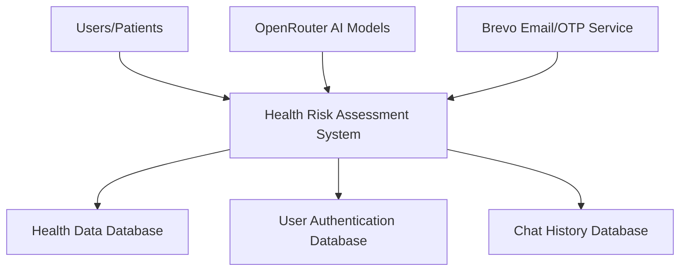
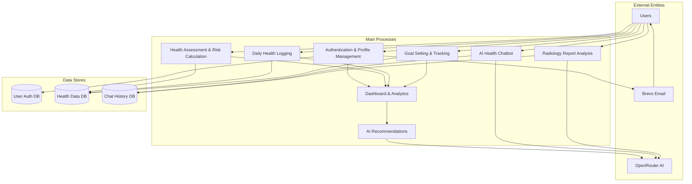
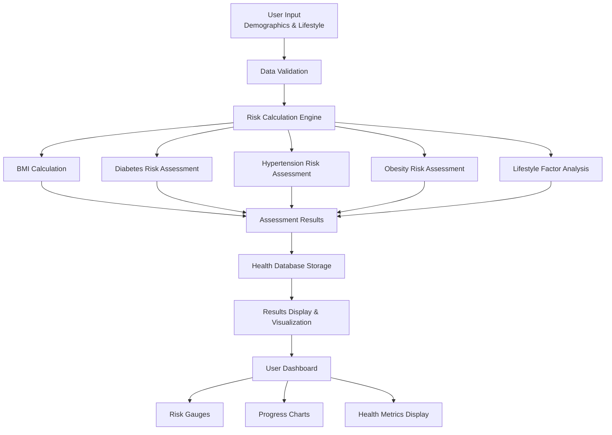
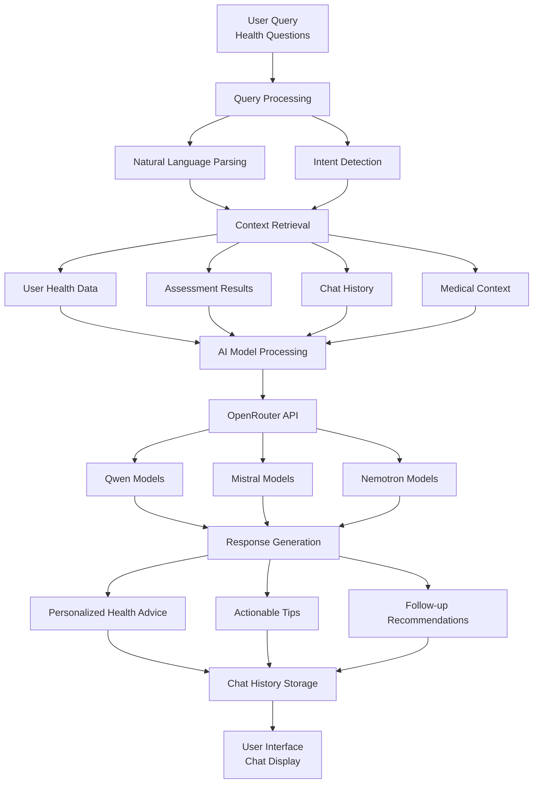

# Data Flow Diagrams for Health Risk Assessment System

## Level 0 - Context Diagram

## Level 1 - Main Processes

## Level 2 - Health Assessment Process

## Level 2 - AI Chatbot Process

## Data Flow Summary

### Primary Data Flows:
1. **User Registration**: Users → Authentication → User Database
2. **Health Assessment**: User Input → Validation → Risk Calculation → Results → Dashboard
3. **Daily Monitoring**: User Logs → Health Database → Progress Tracking → Analytics
4. **Goal Management**: User Goals → Goal Database → Progress Updates → Notifications
5. **AI Interactions**: User Queries → Context → AI Processing → Personalized Responses
6. **Report Analysis**: Medical Files → AI Analysis → Radiology Interpretation → User Display
7. **Communications**: System → Email Service → User Notifications → OTP Verification

### Key Data Transformations:
- **Raw Health Data** → **Risk Scores** → **Personalized Recommendations**
- **User Queries** → **Context-Aware Responses** → **Actionable Health Advice**
- **Medical Reports** → **AI Analysis** → **Clinical Insights**
- **Health Logs** → **Progress Analytics** → **Goal Adjustments**
