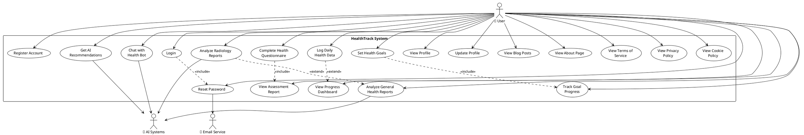

# Use Case Diagram for HealthTrack - Health Risk Assessment System

## Overview
HealthTrack is a comprehensive health risk assessment platform that enables users to monitor their health, receive AI-powered recommendations, and track their wellness journey. The system integrates with external AI services and email providers for enhanced functionality.

## Actors
- **User (Primary Actor)**: Individuals seeking health assessment and monitoring
- **AI Systems (Secondary Actor)**: External AI models (OpenRouter, Tongyi) for analysis and recommendations
- **Email Service (Secondary Actor)**: Brevo email service for OTP and notifications

## Use Case Diagram

## Use Case Categories

### 🔐 Authentication (UC1-UC3)
- **Register Account**: Create new user account
- **Login**: Authenticate existing user
- **Reset Password**: Password recovery with OTP

### 📊 Health Assessment (UC4-UC5)
- **Complete Health Questionnaire**: Comprehensive health data collection
- **View Assessment Report**: AI-generated health risk analysis

### 📈 Daily Tracking (UC6-UC9)
- **Log Daily Health Data**: Record daily health metrics
- **View Progress Dashboard**: Visualize health trends
- **Set Health Goals**: Define wellness objectives
- **Track Goal Progress**: Monitor goal achievement

### 🤖 AI Features (UC10-UC13)
- **Chat with Health Bot**: Interactive AI health assistant
- **Get AI Recommendations**: Personalized health advice
- **Analyze Radiology Reports**: AI-powered medical imaging analysis
- **Analyze General Health Reports**: Document analysis and insights

### 👤 Profile Management (UC14-UC15)
- **View Profile**: Access personal information
- **Update Profile**: Modify account details

### 📖 Content (UC16-UC20)
- **View Blog Posts**: Health education content
- **View About Page**: Platform information
- **View Terms of Service**: Legal terms
- **View Privacy Policy**: Data protection policies
- **View Cookie Policy**: Cookie usage information

## Key Relationships

### Include Relationships (Mandatory)
- Login includes Reset Password (password recovery option)
- Complete Questionnaire includes View Report (assessment completion)
- Set Goals includes Track Progress (goal monitoring)

### Extend Relationships (Optional)
- Log Data extends View Dashboard (enhanced visualization)
- Radiology Analysis extends General Report Analysis (specialized analysis)

## System Integration Points
- **AI Systems**: Powers chatbot, recommendations, and report analysis
- **Email Service**: Handles OTP delivery and notifications
- **Database**: Stores user data, health assessments, and chat history
